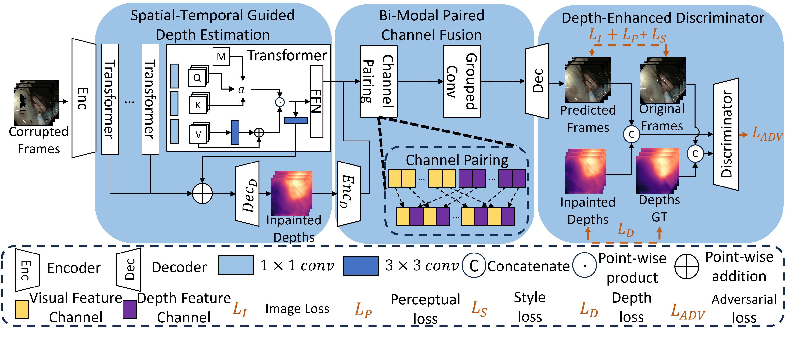

# DAEVI (Depth-Aware Endoscopic Video Inpainting)
The code repository for Depth-Aware Endoscopic Video Inpainting. The pre-trained model for our paper could be found at [here](https://drive.google.com/drive/folders/1vYsUxgmtsQ7V61nIbGEf2kANzsp8Cj9D?usp=sharing). The ArXiv version paper can be found at [here](https://arxiv.org/abs/2407.02675). 

If you encounter any difficulty in implementing our work, please feel free to contact me ([francis.xiatian.zhang@ieee.org](mailto:francis.xiatian.zhang@ieee.org)).




## Preparation
To run our code, you need to prepare the depth pseudo ground truth for your data. In our experiments, we generated our depth pseudo ground truth using [AF-SfMLearner](https://github.com/ShuweiShao/AF-SfMLearner). To reproduce our work, you can find the extracted depth data at this [link](https://durhamuniversity-my.sharepoint.com/:f:/g/personal/slxb76_durham_ac_uk/EsY9YfrENMFMqV6FIMHoZ4EBgTlEzdoal7oN8xX2WozgOw?e=Vrxp5a).

Due to the size of the depth data, only the test set depth ground truth is currently uploaded. The full dataset will be made available once a more efficient data-sharing method is implemented.

## Installation
The Python version used in this code is Python 3.8.5.

```
pip install -r requirement.txt
```


## Training
```
python train.py --model DAEVI --config {Your Config File Path}.json
```

## Inference
```
python test.py  --gpu 0 --overlaid --output results/DAEVI_Output/ --frame datasets/EndoSTTN_dataset/JPEGImages --mask datasets/EndoSTTN_dataset/Annotations --model DAEVI -c release_model/DAEVI_24g -cn 20 --zip --ref_num 10
```
## References
- Repository: [Endo-STTN](https://github.com/endomapper/Endo-STTN).
- Repository: [AF-SfMLearner](https://github.com/ShuweiShao/AF-SfMLearner).

## Citing

If you find this work useful, please consider our paper to cite:

```
@inproceedings{zhang24Depth,
 author={Zhang, Francis Xiatian and Chen, Shuang and Xie, Xianghua and Shum, Hubert P. H.},
 booktitle={Proceedings of the 2024 International Conference on Medical Image Computing and Computer Assisted Intervention},
 series={MICCAI '24},
 title={Depth-Aware Endoscopic Video Inpainting},
 year={2024},
 publisher={Springer},
 location={Marrakesh, Morocco},
}
```
